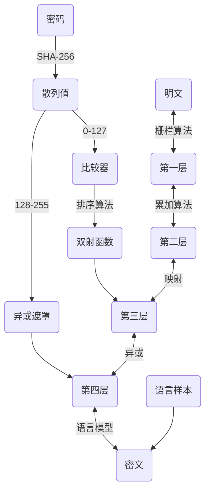

```mermaid
graph TD
    A(密码) -->|SHA-256| B(散列值)
    B --> |0-127| C(比较器)
    B --> |128-255| D(异或遮罩)
    C --> |排序算法| E(双射函数)
    F(明文) <--> |栅栏算法| G(第一层)
    G <--> |累加算法| H(第二层)
    E --> I(第三层)
    H <--> |映射| I
    D --> J(第四层)
    I <--> |异或| J
    J <--> |语言模型| L(密文)
    K(语言样本) --> L
```
